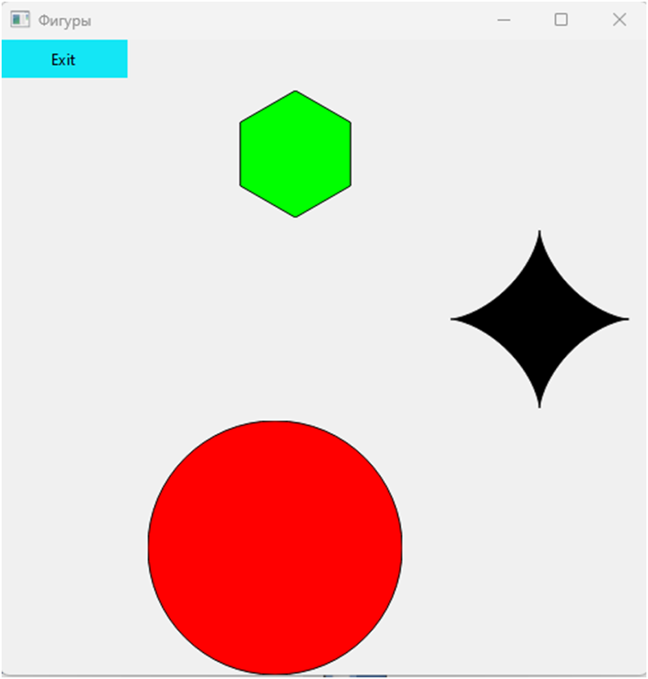

# Программа "Графические объекты с колебательным движением"

## Описание:
Программа реализует графическое отображение трех объектов: окружности, правильного шестиугольника и астроиды. При этом объекты выполняют колебательное движение вдоль горизонтальной оси с различными периодами колебаний.

## Функциональность:
- Отображение графических объектов: окружности, шестиугольника, астроиды.
- Реализация колебательного движения объектов с различными периодами колебаний.
- Применение механизма полиморфизма для работы с разными типами объектов.

## Технологии:
- Язык программирования: C++
- Фреймворк для графического интерфейса: Qt

